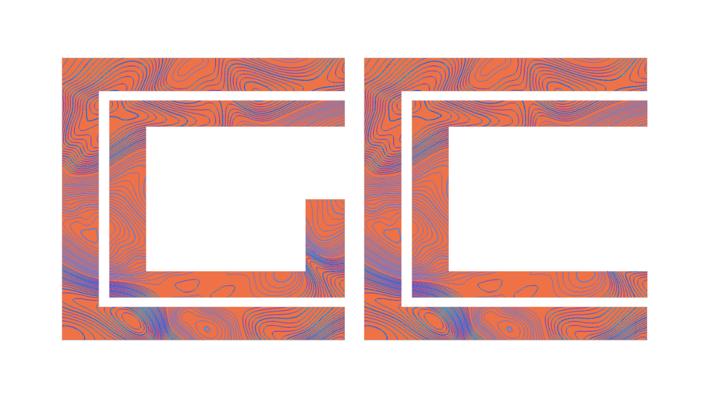

  <picture>
    <source media="(prefers-color-scheme: dark)" srcset="img/cgcc_logos_widetmp.png">
    
  </picture>
  <h1>CGCC</h1>
  <h3>CrossGate Community Collection</h3>

 

## About this project?
  Software & Game distribution platform with community forum to share interaction and feedback, the main component of the CrossGate desktop app API & utility

## Documentation & Journals
  for documentation on how to use, please refer to [website documentation](https://porosive.com/documentation/docs.php) 
  changelog and in progress improvement cam be seen on [this page](https://porosive.com/documentation/changelog.php)
  I'd write some journal note on all progression I remember [here](https://github.com/Qwidio/CrossGate-Community-Collection/blob/main/journals.md) 
  
## running on your own machine
  in your local machine it is recommended for you to have these in your enviroment:
  - PHP 8+ installed
  - compatible MySQL instalation
   

  I'm using XAMPP 8.2.12 because those already installed along with it,
   
  open the phpmyadmin panel via the XAMP control panel
   
  Import the `cgcc.sql` from this repository to your database and make sure the database name are the same in your database config file on `processes/database.php`.
   
  to check if the site are working open up this link `localhost/thePathNameYouExtractThisProjectOn/index.php` on your browser
## Credits
  [MarketingPipeline](https://github.com/MarketingPipeline), [MarkDown Tag](https://github.com/MarketingPipeline/Markdown-Tag) for MarkDown Renderer

  [Cure53](https://github.com/cure53), [DOMPurify](https://github.com/cure53/DOMPurify) used for MarkDown XSS Sanitizer