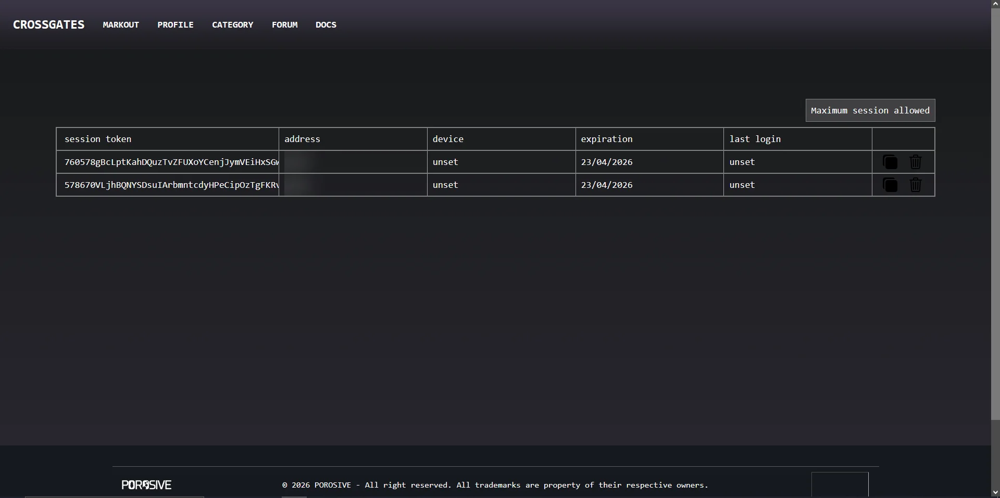
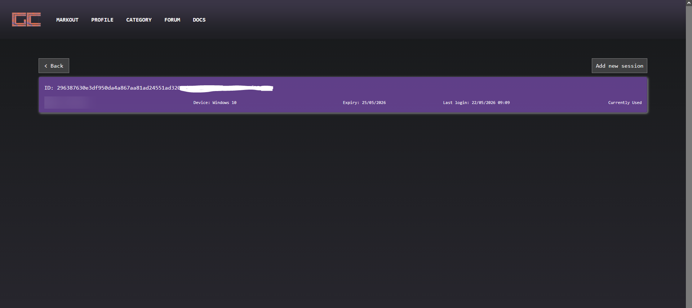
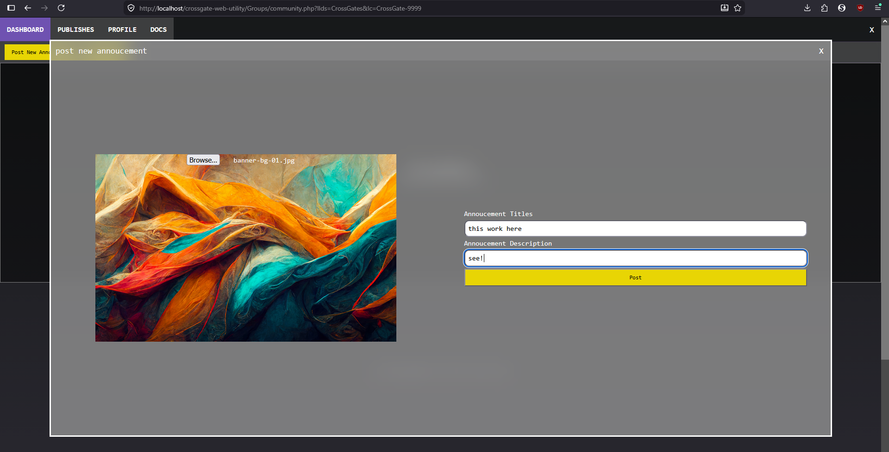
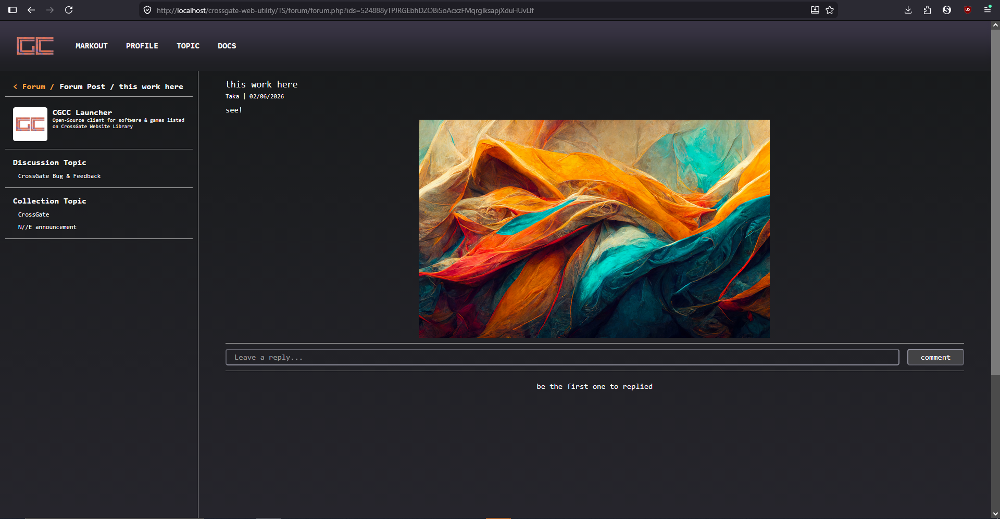
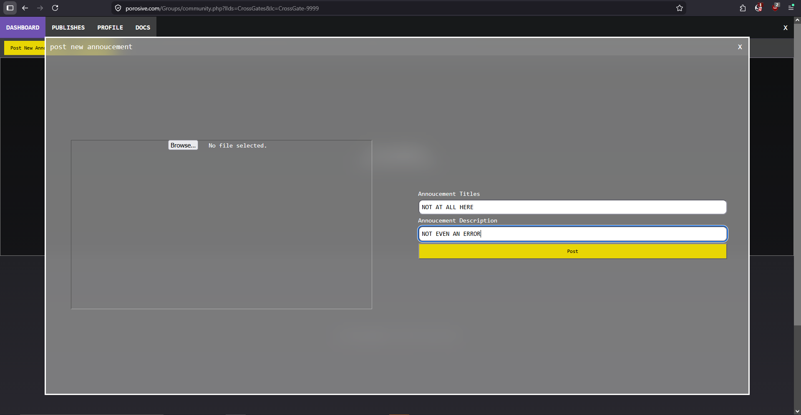
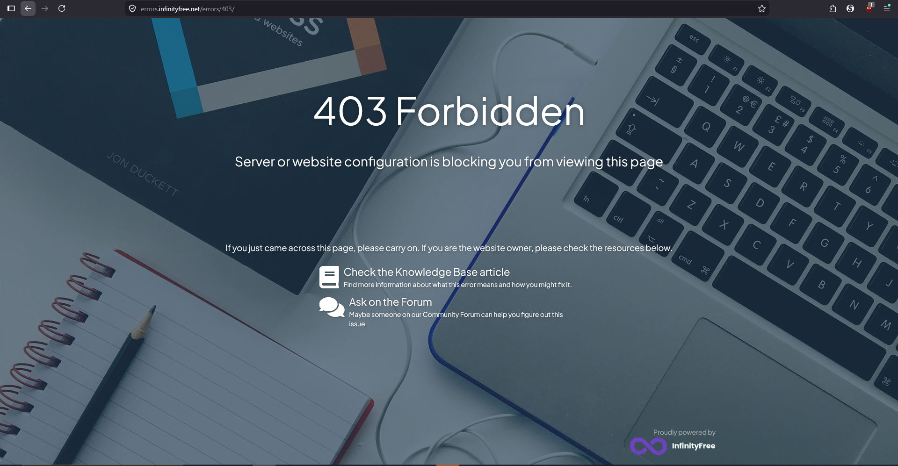

# Project Origin and All of progresses made since then
 January/2025 a simple minded programmer wanted to recreate steam without DRM from scratch, thinking that making it would be very easy when there's no need for DRM lock. Originally named Hydrogens(I know, it's was a stupid name), started with developing the website which I honestly forgot and question why instead of using tailwind I'd just making a less inefficient custom css that treated like bootstrap. the worse of it that I'd still barely understand web development(I'm still is when it comes to javascript and their framework) yet not admiting that learning to make things works is what important instead of making it fancy and modular. 
 Just about a month in and I've got realization that it will still need a desktop launcher and API that both of them I know nothing about, but this got me fired up to continue this project and learn new things to make it finished. Thus began the 6 month of learning how to website, took much time to learn the basics   
 June/2025 project halted for Exam and life but restarted again in October/2025 and renamed to "CrossGate", around mid December/2025 the project finally having shape and somewhat ready for test. So I send this to some people and what I've got was a feedback with unneeded hate... 
 Here's some of the more "friendly feedback": "you project trying to be like steam but it suck like s###", "we have steam, we don't need your c###", those are valid I guess and around that time the web page are a bit dull and even now still not one to one compared to it but then a lot of so called "feedback" being sent to me over the month. 
 Eventually I figured to just stopped hosting the project and blocked contact from them. Around that time I got recommended to join on an event from [hackclub](https://hackclub.com), I didn't know there is such organization and positive community like this that make me wish to discover it before the damage was done. On early January I change the name again into "CrossGate Web Utility" because I'd think it was a fitting name for what it is(even though it isn't) but then life stopped the progression again until March and by then I've lost the ambition to this project and my condition ever slightly get worse. I'd continue developing thanks to the support of my family and that I really don't have things to do after exams(not the type that doomscrolls). 
 Early April/2026 the project renamed into "CrossGate Community Collection" purely so that it can get shortened to "CGCC" and logofied, the styling pallate finalized to pob(purple-orange-blue, not sure if this was the right term) and most of website are stylized to be more organized like what it is now. 
 I apologize to any reader if this sounds like a personal rant but I didn't mean to and cloudn't explain it better otherwise(I'm just bad at explaining things).
   
 This entries started since April/30th but I only write down what I'd still remember every week redesign almost happened and day by day I feel like this project will never ends, this project already took hundreds of hours before May/1st

## for the reviewer/journal reader
 I logged the hours of the time it took for me to making logo, banner art for the websites, research on how to properly make website and RTFM the entire php docs.
 Because out of all things. I avoid using AI as much as I can from my project, in the early development I tried it but everytime it just makes the problem worse and makes me feel dumber each time prompting(I'm not gonna pay premium just to get better hallucinated answer). All reference logged on the [references.md](https://raw.githubusercontent.com/Qwidio/CrossGate/refs/heads/main/references.md) in [this project repository](https://github.com/Qwidio/CrossGate-Web-Utility)

## settings & consent
 It's related to privated profile info and allow groups invites. The first one was planned to added way back in Dec/2025 but forgoten until now, If it's get ticked then achivement and badge will not be shown to publics but post and currently joined groups will still be visible. 
 user can give consent about allowing groups sending invites and turned on by default until they joined a groups after which they must turned it on again if they wanted an invitation again. 
 all of this contained inside settings panel and the invitation message is shown below the settings.

## profile picture
 Yeah it's known profile picture were the most important things that should've been added a while back, priorities shifting every now and then but it is now implemented. At first I cloudn't decide whether `.gif` should be allowed or not but I figured if the size is still within limit why not just allow it. It's only get shown on profile pages anyway. 
 Noted this is also include the profile picture of the Groups profile pages, the groups profile picture is a must to be implemented though like the other it is also only gonna get shown on the (groups) profile pages (and the desktop app if that counts).

## session system

 Thanks to the reviewer from [flavortown](https://flavortown.hackclub.com/), the website now support using session token on the login system. Noted that when user are exceeding session limit, they can only use temporary session and required to tick off "keep me signed in" in order to access the website and removing unused/expired session. This alone took me a good few days to rewrite the auth and login codes

## session ui

old version

new version

 A while back(about 3 weeks ago) The old session page styling made for just the bare minimum, so I change them while borrowing UI styling from other page codes. This time the requested back button included, nothing much changes other than adding the session checker and updating the UI's as of May/11.

## groups-flow
 A place where developer can publish and manage their collection, within it developer can invite and manage members account, edit their public profile, create and managing collection along with making announcement about the future update to their audience. If not because of of the budget constraint and a lot of possible security issue, the Groups-Flow would operate in separate domain and database with a sync system to the main website. This might be revisited in near future if needed. 

## groups-flow auth sessions
 Groups-flow auth system were separated from the website main auth. Using more temporary session implementation though the implementation were similiar, at maximum saved for only 1 day before requiring reauthentication. this decision made because of the high security vulnerability on giving access to the groups collection and community management. And another note to when user signed in again: the old session token in database will be replaced with new ones, truthfully most auth and sessions code were reused/refactor from the main sessions code but adjusted a lot to fit the groups-flow usecase.

## groups-flow access system
 always take a deep breath when i make something and then realizing the security missing something and this is one of them, were do I even begin..
  - Invite system, now comes with nerfed and limited version of [notification](#notification). of course this begin when I've got revelation that if I didn't do this, Individual can get added easily by Groups forcibly without consent.
  - access login & auth, basically a more paranoid login system on steroid and auth system were making sure that every groups pages can only be accessed by identified and approved account by the groups founder.
  - access system can only be created either for the founder account when a new groups created and when an invited user accepted to join the groups that invited them.

## notification 
 While it is look like a notification, doesn't mean this one is a real notification system. It's function are only for notified a Groups invitation to user and nothing else, for now I'd not have plan to expand the functionality.

## collection publishing
 Dedicated management system to create and administer collection, originally the system can be accessed by a normal user but after the creation of the [groups-flow](#groups-flow) the publishing now can only be accessed by allowed members of a groups, this help to make sure reduce creation spamming. 
  - the software file and the rest of the collection creation proccessing are inevitably must be separated into `create_collection.php` and `post_file.php` because I don't believe with the real world connection speed and file upload size limit that this will be possible to be done at the same time without compromising the security, the other way this will be possible probably with the introduction of file chunking but currently I just want this to properly work 
  - `edit.php` handle the collection update, final publishing and archiving. Noted that it just handle the normal image and text data update where the size are still doable for the most cases
  - if not obvious already, the software that will be shipped to this site must be using `.zip` format and preferably on 'store' mode. the reason were that It will took a significant amount of performance to implement separated file upload instead of this, I might implement a way to make some sort of file Ignore & replace list for the client launcher so that publisher can list which file that should/shouldn't be replaced on the client side each time an updates downloaded. 

 this one is by far the most painful stage of this entire project development, not only that this is the critical part of the system but also even a small change will lead to a spiralling bug testing of the entire system.

## collection file manager
 Originally this was planned for future updates the file manager is really needed in order to securely upload and update. The paranoid me really didn't want to mess up this very vunerable part of the project... here's a little breakdown of what created/removed:
  - `post_file.php` were removed and replace with `file_proceed.php`, because the naming doesn't makes sense when it also does processing remove file.
  - `file_manager.php` are the main pages to manage all the existing file on their vault, it will only list file that exist and will even not list phantom file written in the database. Naturally, because of the capability given to this page making this page having more layered security check just to make sure only one collection at a time allowed to be accessed by user.
  - `file_proceed.php` is the one that process everything input and request from the file manager, though not still doubt about allowing file deletion but for now user can remove files that isn't actively used by collection. the checking part was easy enough but making the files get moved into the right folder and updated to databases take hours of just countless debugging and testing, turns out that I forgot to use chmod function... can't wait to be forget about it again and this is not even the worst, it was the remove one. remember what I said about remove files that isn't actively used by the collection? that because even if the unlink function has been called and the removed process is finished, as long as a user still request/downloads the said file it wont get deleted until all request get satisfied and after that the file would actualy get deleted. Until now it still is, I'm just don't want to bother with it anymore and leave it be for time being.

## updated collection views
 Some changes needed for help ease on the server-side, most notably external link where they're now a dynamic name and link that support up to 10 link as previously only support one website and youtube link. 
 It's now also support embedded video demo/trailer although it's optional and only been tested with YT video link.

## reports
 This is a bit of a really late realization when going to ship the project, with no way of reporting at all the community has no way of of reporting "racist" user in the forums or "malicious" publisher that published collection with malware/virus. Even though this is not permanent, I'd implement the universal report tab to be placed on forums detail, user profile, groups profile and collection detail. Each of them are gonna be proccessed possibly between 1 to 5 days depending on the case and of course this is why I required a valid email in registration, when things like this happens there will be emails to the suspected user/groups for confirmation & solution.

## news flash, there's nothing such as free hosting
 I tried using infinityfree for hosting this website but now running into dead end problem where the proccessing file being blocked by them and no possible solution without buying premium, see proof link below
 
on local with the same code mind you

 

 
on the hosting, still with the same code

 
 

 

## things that will be added, removed, revamped
 Not all would be included because there's always a new things to add to my never ending feature wished to be implemented, but I'm not in good condition to do it now and this thing probably need proper hosting and a domain because that domain is not for this if you don't realized by it's name.
 1. captcha's and security
  I have read a few forum(some included in references) on what and how to implement for securing website registration, but not yet ready to do so till the next month
 2. Achievement revamp
  Being honest I don't know what even i'm planning with the achievement, it's fairly a thing that looks simple but a nightmare to implement both backend and frontend. As far as i know the real thing are implemented via sdk and api which i'm sure not gonna be easy, not on the achievement itself but the verification and securing communication between the game/software and the CGCC api's. Only future me will tell how hard or easy it really is.
 3. API's overhaul
  for some client launcher and plugin
 4. Form multi image support
  I'll do it when this get proper hosting
 5. non-groups made topic
  currently only groups/publisher that can create and post on their collection announcement topic
 6. better documentation
  Sorry to all user that have to follow my half baked instruction, I really hope someone can help me with these kind of thing.