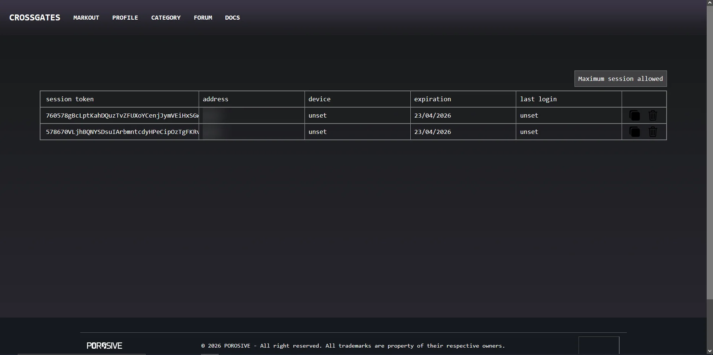
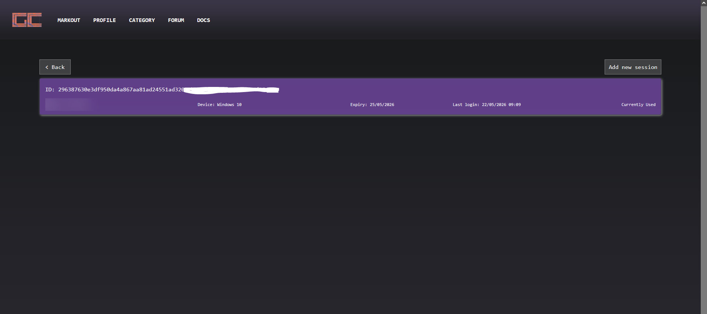
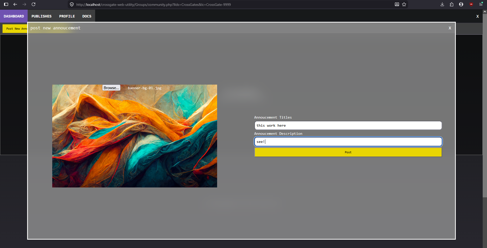
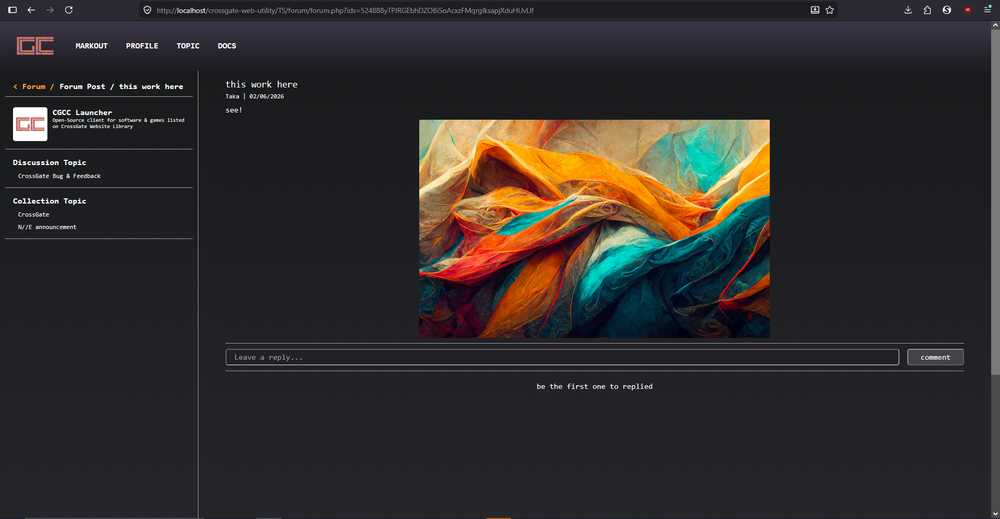
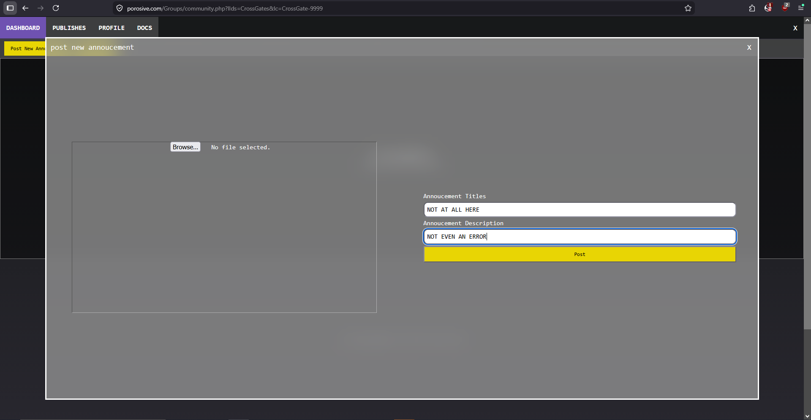
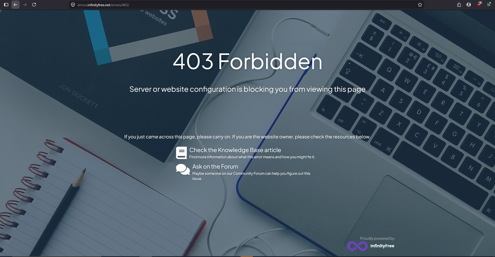

# Project Origin and All of progresses made since then
 January/2025 a simple minded programmer wanted to recreate steam without DRM from scratch, thinking that making it would be very easy when there's no need for DRM lock. Originally named Hydrogens(I know, it's was a stupid name), started with developing the website which I honestly forgot and question why instead of using tailwind I'd just making a less inefficient custom css that treated like bootstrap. the worse of it that I'd still barely understand web development(I'm still is when it comes to javascript and their framework) yet not admiting that learning to make things works is what important instead of making it fancy and modular. 
 Just about a month in and I've got realization that it will still need a desktop launcher and API that both of them I know nothing about, but this got me fired up to continue this project and learn new things to make it finished. Thus began the 6 month of learning how to website, took much time to learn the basics   
 June/2025 project halted for Exam and life but restarted again in October/2025 and renamed to "CrossGate", around mid December/2025 the project finally having shape and somewhat ready for test. So I send this to some people and what I've got was a feedback with unneeded hate... 
 Here's some of the more "friendly feedback": "you project trying to be like steam but it suck like s###", "we have steam, we don't need your c###", those are valid I guess and around that time the web page are a bit dull and even now still not one to one compared to it but then a lot of so called "feedback" being sent to me over the month. 
 Eventually I figured to just stopped hosting the project and blocked contact from them. Around that time I got recommended to join on an event from [hackclub](https://hackclub.com), I didn't know there is such organization and positive community like this that make me wish to discover it before the damage was done. On early January I change the name again into "CrossGate Web Utility" because I'd think it was a fitting name for what it is(even though it isn't) but then life stopped the progression again until March and by then I've lost the ambition to this project and my condition ever slightly get worse. I'd continue developing thanks to the support of my family and that I really don't have things to do after exams(not the type that doomscrolls). 
 Early April/2026 the project renamed into "CrossGate Community Collection" purely so that it can get shortened to "CGCC" and logofied, the styling pallate finalized to pob(purple-orange-blue, not sure if this was the right term) and most of website are stylized to be more organized like what it is now. 
 I apologize to any reader if this sounds like a personal rant but I didn't mean to and cloudn't explain it better otherwise(I'm just bad at explaining things).
   
 This entries started since April/30th but I only write down what I'd still remember every week redesign almost happened and day by day I feel like this project will never ends, this project already took hundreds of hours before May/1st

## settings & consent
 It's related to privated profile info and allow groups invites. The first one was planned to added way back in Dec/2025 but forgoten until now, If it's get ticked then achivement and badge will not be shown to publics but post and currently joined groups will still be visible. 
 user can give consent about allowing groups sending invites and turned on by default until they joined a groups after which they must turned it on again if they wanted an invitation again. 
 all of this contained inside settings panel and the invitation message is shown below the settings.

## profile picture
 Yeah it's known profile picture were the most important things that should've been added a while back, priorities shifting every now and then but it is now implemented. At first I cloudn't decide whether `.gif` should be allowed or not but I figured if the size is still within limit why not just allow it. It's only get shown on profile pages anyway. 
 Noted this is also include the profile picture of the Groups profile pages, the groups profile picture is a must to be implemented though like the other it is also only gonna get shown on the (groups) profile pages (and the desktop app if that counts).

## session system

 Thanks to the reviewer from [flavortown](https://flavortown.hackclub.com/), the website now support using session token on the login system. Noted that when user are exceeding session limit, they can only use temporary session and required to tick off "keep me signed in" in order to access the website and removing unused/expired session. This alone took me a good few days to rewrite the auth and login codes

## session ui

old version

new version

 A while back(about 3 weeks ago) The old session page styling made for just the bare minimum, so I change them while borrowing UI styling from other page codes. This time the requested back button included, nothing much changes other than adding the session checker and updating the UI's as of May/11.

## groups-flow
 A place where developer can publish and manage their collection, within it developer can invite and manage members account, edit their public profile, create and managing collection along with making announcement about the future update to their audience. If not because of of the budget constraint and a lot of possible security issue, the Groups-Flow would operate in separate domain and database with a sync system to the main website. This might be revisited in near future if needed. 

## groups-flow auth sessions
 Groups-flow auth system were separated from the website main auth. Using more temporary session implementation though the implementation were similiar, at maximum saved for only 1 day before requiring reauthentication. this decision made because of the high security vulnerability on giving access to the groups collection and community management. And another note to when user signed in again: the old session token in database will be replaced with new ones, truthfully most auth and sessions code were reused/refactor from the main sessions code but adjusted a lot to fit the groups-flow usecase.

## groups-flow access system
 always take a deep breath when i make something and then realizing the security missing something and this is one of them, were do I even begin..
  - Invite system, now comes with nerfed and limited version of [notification](#invitation-notification). of course this begin when I've got revelation that if I didn't do this, Individual can get added easily by Groups forcibly without consent.
  - access login & auth, basically a more paranoid login system on steroid and auth system were making sure that every groups pages can only be accessed by identified and approved account by the groups founder.
  - access system can only be created either for the founder account when a new groups created and when an invited user accepted to join the groups that invited them.

## invitation notification 
 While it is look like a notification, doesn't mean this one is a real notification system. It's function are only for notified a Groups invitation to user and nothing else, for now I'd not have plan to expand the functionality.

## collection publishing
 Dedicated management system to create and administer collection, originally the system can be accessed by a normal user but after the creation of the [groups-flow](#groups-flow) the publishing now can only be accessed by allowed members of a groups, this help to make sure reduce creation spamming. 
  - the software file and the rest of the collection creation proccessing are inevitably must be separated into `create_collection.php` and `post_file.php` because I don't believe with the real world connection speed and file upload size limit that this will be possible to be done at the same time without compromising the security, the other way this will be possible probably with the introduction of file chunking but currently I just want this to properly work 
  - `edit.php` handle the collection update, final publishing and archiving. Noted that it just handle the normal image and text data update where the size are still doable for the most cases
  - if not obvious already, the software that will be shipped to this site must be using `.zip` format and preferably on 'store' mode. the reason were that It will took a significant amount of performance to implement separated file upload instead of this, I might implement a way to make some sort of file Ignore & replace list for the client launcher so that publisher can list which file that should/shouldn't be replaced on the client side each time an updates downloaded. 

 this one is by far the most painful stage of this entire project development, not only that this is the critical part of the system but also even a small change will lead to a spiralling bug testing of the entire system.

## collection file manager
 Originally this was planned for future updates the file manager is really needed in order to securely upload and update. The paranoid me really didn't want to mess up this very vunerable part of the project... here's a little breakdown of what created/removed:
  - `post_file.php` were removed and replace with `file_proceed.php`, because the naming doesn't makes sense when it also does processing remove file.
  - `file_manager.php` are the main pages to manage all the existing file on their vault, it will only list file that exist and will even not list phantom file written in the database. Naturally, because of the capability given to this page making this page having more layered security check just to make sure only one collection at a time allowed to be accessed by user.
  - `file_proceed.php` is the one that process everything input and request from the file manager, though not still doubt about allowing file deletion but for now user can remove files that isn't actively used by collection. the checking part was easy enough but making the files get moved into the right folder and updated to databases take hours of just countless debugging and testing, turns out that I forgot to use chmod function... can't wait to be forget about it again and this is not even the worst, it was the remove one. remember what I said about remove files that isn't actively used by the collection? that because even if the unlink function has been called and the removed process is finished, as long as a user still request/downloads the said file it wont get deleted until all request get satisfied and after that the file would actualy get deleted. Until now it still is, I'm just don't want to bother with it anymore and leave it be for time being.

## updated collection views
 Some changes needed for help ease on the server-side, most notably external link where they're now a dynamic name and link that support up to 10 link as previously only support one website and youtube link. 
 It's now also support embedded video demo/trailer although it's optional and only been tested with YT video link.

## reports
 This is a bit of a really late realization when going to ship the project, with no way of reporting at all the community has no way of of reporting "racist" user in the forums or "malicious" publisher that published collection with malware/virus. Even though this is not permanent, I'd implement the universal report tab to be placed on forums detail, user profile, groups profile and collection detail. Each of them are gonna be proccessed possibly between 1 to 5 days depending on the case and of course this is why I required a valid email in registration, when things like this happens there will be emails to the suspected user/groups for confirmation & solution.

## news flash, there's nothing such as free hosting
 I tried using infinityfree for hosting this website but now running into dead end problem where the proccessing file being "403 forbidden" by them and no possible solution without buying premium, see proof link below
 
 on local with the same code mind you

 

 
 on the hosting, still with the same code

 
 

 
 Update: the word "announce" were specifically being blocked to be used as directive and after changing the file names the site works again, really got me thinking the code were broken internally.

## june 12th, api auth and access
    I've finished the API's for anyone that wanted to test the project locally or developing their own client downloader, noted that the hosting infrastruct currently used for the website doesn't support API's/non-browser processing so this functionallity aren't available on the demo site.
    The api using X-Api-Keys because the plain token won't do to secure it(I'm sure this ain't enough, at the end of it nothing is secure).
    Api token can be obtained from the groups api panel page, for reasons I'm already forget because I coded while being heavily sleeply but can't sleep.
    and yeah, download api does kinda work but it really not the secure way I believed. well I have no pen tester(no, I won't trust AI for that)
 

## June 13th, changelog 
    there's a changelog page made specifically because I don't wanna explain what changes made in what time every time people asked(I'm really the forgetful ones)

## June 18th, working on markout removal feature
    today when playing with the UI and looking at the progress made for the last months I do realize that the user cannot removed the markedout collection from the library, it must be assumed that the user would not need to removed any of the collection they markedout in the first placed but I realized if a lot of the marked collection were discontinued/defunct then this would become a bit of a problem.

## June 19th, MarkOut UI Overhaul and working on desktop client
    Really having a hard time so the overhaul took longer to finish, the UI have an inspiration from somewhere and now I think the right time to took care on some database clearup and restructuring(again). while not much have gotten changed from a glance and almost none in the backend, but this UI changes will set up the stage for more feature planned to get added soon.
 

    I started developing the client for the website and it's place on the `/barenative/` folder, the folder name has nothing to do with the project and I'm using python with pyQt for ease up working with UI. The only reason for it because from my research that using the Python with PyQt does make the app multiplatform and I do test the code on linux but not really into the build version and not with any of the API's installed, so the 'bare' in the 'barenative' as in 'bare minimum'.

## June 24th - 26th. Bug fixing, naming changes & API separation
  ### Bug fixing the file naming mess
    I'm unknowingly used `time()` function in every ID naming without thinking that it uses 'slash'(/) format, when on testing day before in writing this, the upload always says failed without saying what's wrong leading me to get a panic attack but the next when I look at the one of the collection ID in that moment I realized it was the ID containing unwanted slash. so yeah y'know what will happen next, I took the unix converted date as replacement to the `time()` function. 
  ### Changing folder naming and forum image placement
    It's now standardized after library collection got their own folder that the forum post images now also saved into their own separate folder, it wasn't planned and just happened after finishing the bug fixing of the file naming.
  ### API separation in means that making the API method organized
    It's meant that making the API method organized in the bandaided way, separating the login auth and session checking auth will makes things more organized and may leads to better optimized the code without affecting another of them. Routing is prefered to be used as the better implementation in the future, see the new API docs for more info.

## June 28th - 29th. Moving processor file & updates
  ### moved `post_out.php`
    A little organizing because I don't think there's any other component other that it and the file really fall down to 'processor file' category, what defined it? put it simply If it has no front-end code inside and it's main job is to process data from other pages then it categorized as the 'processor file' though the file naming sometimes a bit misleading to what they're processing.
  ### API & DB updates
    providing more data return to add even more functionallity on the client launcher.
    Added fdrLibs, rollbacks, detailData 

## working on experiementals
after fidlling with api and learn few basics of python, pyqt and flask the program started to take shaped, I realized this might be a wrong implementation so try it at your own risk or wait until production release.

## final update
  this will be the last major changes this site gonna get for a while. There will still some small update and I planned to rewrite the project using more modern language and framework, but it will have to wait after I got to work on another project. here's a run trough of what I've been working on since the last update:

  ### another endless work begin
  Last month when I thought everything is done last month it came to my head that the badges/achievement weren't implemented at all and so I start by cleaning the database structure but then it spirals to alot of things that haven't been added like client download pages, badge maker, the markout stats and badges update API, and many more I haven't worked on. I'm writing down below this part of what have/haven't been added as I'm progressing to finish the project.

  ### badges implemented and finished publishing system
  I'd eventually settled on badge system where there's no rarity or level so it's easier to implement. Doesn't meant this was simple either as it uses grouping system where every badges created required to have one badge-group id related to it and if a badge-group set as "deleted" then the rest of badges related to it won't be shown like the badge-group itself, I guess it's still simpler compared to most achievement system. 
  creating badges will be quite easy if done right, first is to add the badge-group if there's none exist then what you do is create one before and then select the badges-group that just created on the option input when creating the new badges.
   
  When working to implement the "recommended system spec" on editing collection data I found that the external link array input check and final data are not implemented properly leading to "null" value when saving to database and making the edit dialog half broken,
  I fixed it now and the recspecs are also implemented along with it.  

  ### badges page
  After making the badges manager for publishers ofcourse the page that display them must be created. I don't know why do I use the same page for 3 different type and this is not the first one, library view page does the same but it does not share the same array and formating unlike this one.
  I tried to paginate but I conclude that I don't want this to get even more complicated and for this use case where I'm just gonna put hard limit for publisher to not make more than 50 badges on each collection.

  ### small and not so small changes
  examples like adding the new .ico logo to every pages, removing uneeded query to show "groups" button but also something like:
  - fixing `/publishing/file_proceed.php` to only allow removal of .zip and some additional code cleanup
  - fixed `/publishing/create_collection.php` sanitized topic id handling
  - `/publishing/manage.php`, added path to badges manager page, removed all the time unused footer
  - `/processes/markout.php`, added favbadge attribute to the processed saved array so it doesn't get reset every MarkOut request
  - `/processes/connect_regist.php`, shortened profiletags format, also added favbadge attribute
  - `/Library/core/view.php`, I changed the use of cdn for rendering markdown to local `/scriptstuff/` folder so it will reduced the need on external service. I did put the credit on the readme file if you want to know what I'd use for markdown rendering. 

  ### slight update on groups-flow
  I haven't fully tested the effect of joining multiple groups but it should now be possible with the new login page that instead of asking the username which will always be the same as you main account username replaced with the option input with the list the groups you're currently have access to.
  On the `/Groups/api_request.php` now require the access role of founder or developer to request new api token. the `/Groups/announce.php` and `/Groups/proceed_community,php` removed unused column data on query request and replaced value randomizer function with bin2hex function.
  I'd also removed unused 'IconAlt' and a column on query request like the other on `/Groups/profile.php`, updated .ico logo and page naming

  ### new settings page and updated profile page
  I also made many changes to the profile page like replacing old badges display with new favorite badge card display and new background themes that can be personalized, I did removed the image attachment of the posted forum so because it really slows the loading times as the number of post being made.
  When working on adding more personalization I feel that it would be too bloated so I removed the settings panel on profile.php and created dedicated settings page for changing profile picture, edit the profile bio, feature their favorite badge, changing profile background-theme and set the privacy related settings.
  The Invites were also moved to the settings page, and I did fixed the bug on `/processes/bionic.php` where saved privated becomes null when privated input checkbox being unticked, also added more settings attribute and the new favbadge attribute on saved array. Changed the redirect to settings page and allow for empty "bioedit" input for clearing profile bio.
  
  ### updated collection browse page
  added pagination with I swear makes things even more complicated than it should, but nonetheless I added the pagination that were planned a bit long ago while also doing code cleanup 

  ### modified view page for new badges and proper recspecs
  Ofcourse it need to be showcased on the collection view page now that badges are functional, I tried to be creative but ultimately just reusing the same technique as the badges page with the only difference that this only showns small quantity of the collection badge display in icon only and for me it's good enough.
  Recspecs are now implemented dynamically so that publisher can set the recommended system specification so that user know if their system are meet the target requirement.

  ### Updated API
  I didn't have too much comment about this because I did try to avoid changing this part to focus on the client and pretty much not much changed other than a few logic update: 
  - `/api/auth.php`, removed unneeded session query check because why not
  - `/api/reauth.php`, also removed the unneeded check
  - `/api/getcollection.php`, update the check and the returned data

  ### New API
  this part does at first thought to be difficult but then I've done the logic for the badges page and processing so this one is just a bit of modification. The hour stat updater was really showing the condition of my mind in that day, I choose to use lastlog attribute as the user online indicator because it will not require me to constantly update user status between each minute because when the user isn't updating their lastlog then the other end will simply assume theyre offline(the treshold was between 1-2 minutes).
  - `/api/badges.php`, it serve to return an user profile badges and an collection badges
  - `/api/updatebadges.php`, function to update user profile badges, basically just check if user already achieved it and if the badges actually available
  - `/api/statsUpdate.php,` that update user collection total "hours" and last login but funnily when working on the heartbeat it seems that it can do both more efficiently than this so there's "hours" of work wasted
  - `/api/heartbeat.php`, the API that updating user logged session "lastlog" attribute and "hours" stats of the currently running software

  ### client launcher final update
  I might have to stop developing this program, any more feature added will just delay the launch longer and it already contain more than what required as an example including:
  - profile stats sync with the collection detail page
  - config file that save user config and custom directory
  - tray instance(optional) to make the program run in the background
  - working download, update and rollback software
  - launch and stop handler that can track if the collection software is running
  - rollback/older version of collection software still can be launched without forced to be updated
  - local api routes to universally allow collection software request user info and award badge
  - badge popup when user obtained a badge and when you logged into the launcher for the first time, your account will be rewarded with a badges as proof and test that the badges worked
  - settings page for option to set default global installation and clearing logged sessionas and last minute decided to add profile info on the settings to tell what account we're logged in, no pfp because I don't wanna work on the API again or else it will cause even more delay
  one of the hardest hurdle was when trying to set dark mode for the window control bar, at first I thought it will be easy to do natively but no there's next to forum question mentioning about it then I dig around on some forum question that kind of related and found a windows the "dwapi" and "dwmwindowattribute", In the end I gave up on searching for a overflow forum question that doesn't exist about implementing it and instead asked AI to assist me suprisingly it's simpler than I thought it will be.
  The other hurdle might be trying to test and build the project for other operating system, as of now due to lack of resource and time to do so as of now my 

  ### client official download page
  It's optional really but I feel like why not(I end up spending a lot of effort on making the art on that page), only in this page you can see how many were online and currently playing user but this might change on smaller update in the future.

  ### github release
  This is the reason why say it's optional because of course being open-source, I suppose people will look at the release page on github rather than the webpage that lately have been constantly changing, unfortunately as I said before this release only for windows as I cannot test the project on other os becuase I don't have the resource to use vmachine and I do have linux machine but it's broken(again)

  ### last minute changes
  ofcourse things goes wrong again when doing run trough, this time the groups-flow api key that needed to be created on the registration. Fixed `/publishing/create_collection.php`,`/publishing/edit.php` and `/publishing/badge_proceed.php` to not handling inexistent images, fixed the external link handling that hasn't been updated on `/publishing/create_collection.php`. Added demo video on the client page.

  ### documentation
  so far making the documentation is difficult given that I'm keep forgeting to makes note of the changes after done coded a component, mostly I'm able to by opening the code again and read the process again but even then it sometimes is not clear.
  But it's finished anyway, now the docs are available and I separated the technical docs into two different pages of [groups & publishing](documentation/groupspublishing.php) and [Api & Client](documentation/api.php) while documenting the non-technical one on `/documentation/docs.php`.
    

## to do list of the future
  these are what needed to be achieved for future updates but either these or language migration that first get done
  1. auto-emailing
  2. Non-groups created new topic
  3. Better forum/collection moderation
  4. separate the collection announcement from the forum systems